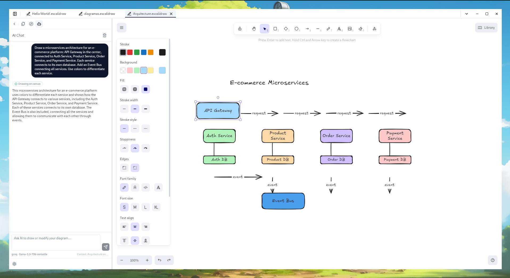

# Excalidraw App

A desktop Excalidraw editor with an embedded AI assistant that draws diagrams directly on the canvas from natural language. Built with Tauri v2, React 19, and a multi-provider AI system (Anthropic, Groq, OpenAI).



---

## Features

| System                  | Description                                                                                                                                            |
| ----------------------- | ------------------------------------------------------------------------------------------------------------------------------------------------------ |
| **AI Chat**             | Sidebar panel with streaming AI that draws directly on the canvas — no copy-paste, no JSON. Natural language → diagram.                                |
| **Multi-provider AI**   | Swap between Anthropic (Claude), Groq (Llama), and OpenAI (GPT) from Settings. API keys stored securely in Tauri Store.                                |
| **Diagram canvas**      | Full Excalidraw editor per tab — open, edit, and save `.excalidraw` files from your filesystem.                                                        |
| **DiagramController**   | Imperative API registry that exposes the live Excalidraw instance to AI, plugins, and drag-drop.                                                       |
| **OS drag & drop**      | Drop `.excalidraw` files to open them as tabs. Drop images (`png`, `jpg`, `svg`…) to insert directly on canvas.                                        |
| **Tab system**          | Multi-tab UI with LRU eviction, pin/unpin, dirty indicator, and per-tab canvas isolation.                                                              |
| **Plugin architecture** | Extend the app from isolated plugin modules — register routes, sidebar sections, commands, keybindings, and now `api.diagram.*` to control the canvas. |
| **Keybinding engine**   | Chord sequences (`Ctrl+K Ctrl+S`), `when` context expressions, per-source priority.                                                                    |
| **Persistent storage**  | Zustand `persist` over Tauri Store — settings, theme, and appearance survive restarts.                                                                 |
| **Theming**             | Light/dark/system theme + appearance config (font size, border radius, high contrast).                                                                 |

---

## How the AI works

The AI Chat panel lives in the sidebar. Type a prompt in natural language — the assistant calls embedded tools (`draw_elements`, `clear_canvas`, `get_elements`, `update_element`) that interact with the live canvas through the `DiagramController`. No external MCP server required.

The system prompt is based on the official Excalidraw MCP element format, including labeled shapes, arrow bindings, and the `cameraUpdate` pseudo-element for viewport control.

**Agentic loop**: the model keeps calling tools until it's done drawing, then responds with a brief explanation. Tool results are fed back automatically — you never see raw JSON in the chat.

---

## Tech stack

- [Tauri v2](https://tauri.app) — desktop runtime
- [React 19](https://react.dev)
- [TypeScript](https://www.typescriptlang.org) — strict mode
- [Excalidraw](https://excalidraw.com) — canvas engine
- [Zustand 5](https://zustand-demo.pmnd.rs) — state management
- [Tailwind CSS v4](https://tailwindcss.com)
- [Radix UI](https://www.radix-ui.com) — accessible primitives
- [React Router v7](https://reactrouter.com)
- [Vite](https://vite.dev) + [pnpm](https://pnpm.io)

---

## Getting started

### Prerequisites

- [Node.js](https://nodejs.org) 20+
- [pnpm](https://pnpm.io) — `npm install -g pnpm`
- [Rust](https://rustup.rs) — required by Tauri
- Tauri prerequisites: [Linux](https://tauri.app/start/prerequisites/#linux) / [macOS](https://tauri.app/start/prerequisites/#macos) / [Windows](https://tauri.app/start/prerequisites/#windows)

### Install and run

```bash
git clone https://github.com/olivio-git/excalidraw-app
cd excalidraw-app
pnpm install

# Full desktop app
pnpm tauri:dev
```

### Build for production

```bash
pnpm tauri:build
```

---

## AI setup

1. Open **Settings → AI**
2. Select your provider (Anthropic, Groq, or OpenAI)
3. Paste your API key and click **Save**
4. Open or create a diagram tab
5. Click the **Bot** icon in the sidebar to open AI Chat

The AI key is stored in `~/.local/share/<app>/ai-settings-storage.json` via Tauri Store — never in localStorage or git.

---

## Project structure

```
src/
├── core/
│   ├── diagram/            # DiagramController singleton + hooks
│   ├── keybindings/        # Keybinding registry, chord buffer
│   ├── routing/            # RouteRegistry, TabRouter
│   ├── shell/              # Shell, DiagramSidebar, TitleBar
│   ├── storage/            # Tauri Store adapter for Zustand
│   └── tabs/               # Tab store, TabBar, TabContent
├── features/
│   ├── ai-chat/            # AI Chat panel, providers, stores, system prompt, tools
│   ├── diagram/            # DiagramCanvas (Excalidraw wrapper)
│   └── settings/           # Settings page + AI configuration panel
├── plugins/                # Plugin system + api.diagram.* extension
├── shared/                 # UI components (shadcn/ui), utilities
└── stores/                 # Theme, appearance

src-tauri/                  # Rust backend + capabilities
docs/
├── ARCHITECTURE.md
└── SDD.md
```

---

## Plugin API — diagram control

Plugins can now control the active canvas through `api.diagram.*`:

```ts
activate(api) {
  // Read current elements
  const elements = api.diagram.getElements();

  // Add elements programmatically
  api.diagram.addElements([...]);

  // Replace entire scene
  api.diagram.updateScene({ elements: [...], appState: {...} });

  // Wait for a specific canvas instance to be ready
  const excalidrawApi = await api.diagram.waitForInstance(instanceId);
}
```

---

## Architecture reference


See [`docs/ARCHITECTURE.md`](docs/ARCHITECTURE.md) and [`docs/SDD.md`](docs/SDD.md).

## License

MIT — see [LICENSE](LICENSE).
