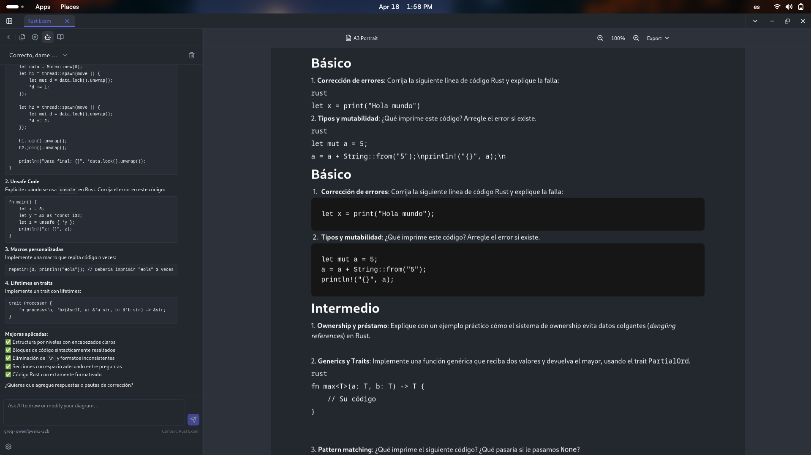
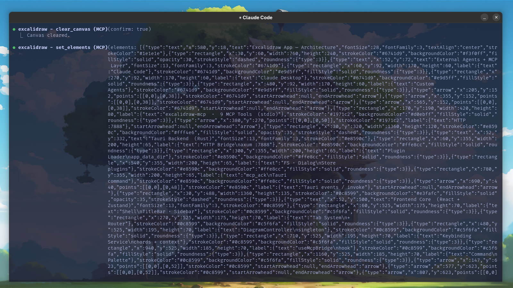
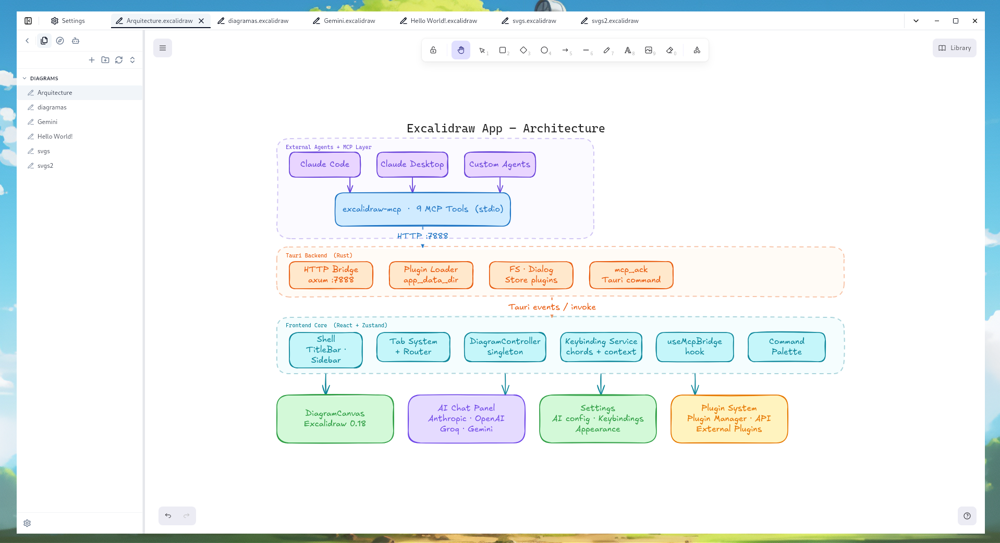
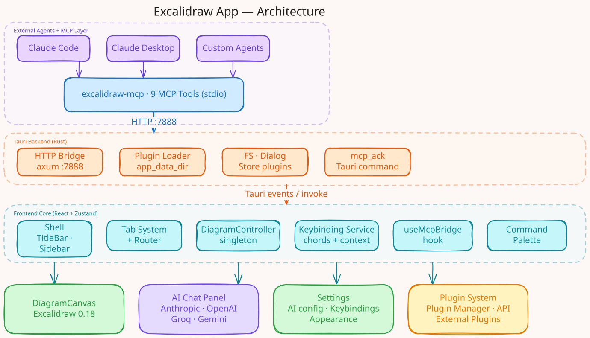

# Excalidraw App

A desktop Excalidraw editor with an embedded AI assistant and an MCP server that lets external agents control the live canvas. Built with Tauri v2, React 19, and a multi-provider AI system (Anthropic, Groq, OpenAI, Gemini).



---

## MCP in action

The architecture diagram below was generated entirely by Claude Code — without touching the app. An external agent called `set_elements` and `export_svg` via the MCP server and drew directly on the live canvas.

| Claude Code calling the MCP                                                  | Result on the live canvas                                                          |
| ---------------------------------------------------------------------------- | ---------------------------------------------------------------------------------- |
|  |  |

---

## Architecture



> **This diagram was drawn by Claude Code via the app's own MCP server** — an external agent connected to the live canvas, called `draw_elements` and `export_svg` without opening the app. That's what this project enables.

---

## Features

| System                  | Description                                                                                                                                        |
| ----------------------- | -------------------------------------------------------------------------------------------------------------------------------------------------- |
| **MCP server**          | Standalone MCP server (`excalidraw-mcp`) that exposes the live canvas to any external agent — Claude Code, Claude Desktop, or custom automation.   |
| **AI Chat**             | Sidebar panel with streaming AI that draws directly on the canvas — no copy-paste, no JSON. Natural language → diagram.                            |
| **Multi-provider AI**   | Swap between Anthropic (Claude), Groq (Llama), OpenAI (GPT), and Google (Gemini) from Settings. API keys stored securely in Tauri Store.           |
| **Diagram canvas**      | Full Excalidraw editor per tab — open, edit, and save `.excalidraw` files from your filesystem.                                                    |
| **DiagramController**   | Imperative API registry that exposes the live Excalidraw instance to AI, plugins, drag-drop, and MCP.                                              |
| **OS drag & drop**      | Drop `.excalidraw` files to open them as tabs. Drop images (`png`, `jpg`, `svg`…) to insert directly on canvas.                                    |
| **Tab system**          | Multi-tab UI with LRU eviction, pin/unpin, dirty indicator, and per-tab canvas isolation.                                                          |
| **Plugin architecture** | Extend the app from isolated plugin modules — register routes, sidebar sections, commands, keybindings, and `api.diagram.*` to control the canvas. |
| **Keybinding engine**   | Chord sequences (`Ctrl+K Ctrl+S`), `when` context expressions, per-source priority.                                                                |
| **Persistent storage**  | Zustand `persist` over Tauri Store — settings, theme, and appearance survive restarts.                                                             |
| **Theming**             | Light/dark/system theme + appearance config (font size, border radius, high contrast).                                                             |

---

## MCP server

The app ships an `excalidraw-mcp` Node.js server that bridges external agents to the live canvas over a local HTTP bridge (axum, port 7888).

**Available tools:**

| Tool                | Description                                            |
| ------------------- | ------------------------------------------------------ |
| `get_elements`      | Read all elements from the active canvas               |
| `draw_elements`     | Add elements using the Excalidraw skeleton format      |
| `set_elements`      | Replace the entire canvas content                      |
| `update_element`    | Patch a specific element by id                         |
| `clear_canvas`      | Clear all elements (requires `confirm: true`)          |
| `export_svg`        | Export the current diagram as an SVG string            |
| `create_diagram`    | Create a new `.excalidraw` file and open it            |
| `save_diagram`      | Save the active diagram to disk                        |
| `open_file`         | Open a `.excalidraw` file as a tab (no duplicates)     |
| `get_active_tab`    | Get metadata about the active tab                      |
| `list_tabs`         | List all open tabs                                     |
| `focus_tab`         | Switch to a tab by id or file path                     |
| `close_tab`         | Close a tab by id                                      |
| `get_workspace_dir` | Get the configured workspace directory path            |
| `list_workspace`    | List files and folders in the workspace                |
| `delete_file`       | Delete a file from the workspace                       |
| `rename_file`       | Rename or move a file                                  |
| `create_folder`     | Create a folder in the workspace                       |
| `file_stat`         | Get metadata (size, modified) for a file               |
| `copy_file`         | Copy a file within the workspace                       |
| `explorer_state`    | Get the current file explorer state (expanded, active) |
| `get_selection`     | Get currently selected files in the explorer           |
| `set_selection`     | Set the file explorer selection programmatically       |
| `toggle_folder`     | Expand or collapse a folder in the explorer            |

The server is registered automatically for Claude Code via `.mcp.json`. For Claude Desktop, add it to your `claude_desktop_config.json`:

```json
{
  "mcpServers": {
    "excalidraw": {
      "command": "node",
      "args": ["/absolute/path/to/excalidraw-app/excalidraw-mcp/dist/index.js"]
    }
  }
}
```

Build the server once before using it:

```bash
cd excalidraw-mcp && npm install && npm run build
```

---

## How the AI works

The AI Chat panel lives in the sidebar. Type a prompt in natural language — the assistant calls embedded tools (`draw_elements`, `clear_canvas`, `get_elements`, `update_element`) that interact with the live canvas through the `DiagramController`. No external MCP server required for in-app AI.

The system prompt is based on the official Excalidraw MCP element format, including labeled shapes, arrow bindings, and the `cameraUpdate` pseudo-element for viewport control.

**Agentic loop**: the model keeps calling tools until it's done drawing, then responds with a brief explanation. Tool results are fed back automatically — you never see raw JSON in the chat.

---

## Tech stack

- [Tauri v2](https://tauri.app) — desktop runtime + axum HTTP bridge
- [React 19](https://react.dev)
- [TypeScript](https://www.typescriptlang.org) — strict mode
- [Excalidraw](https://excalidraw.com) — canvas engine
- [Zustand 5](https://zustand-demo.pmnd.rs) — state management
- [Tailwind CSS v4](https://tailwindcss.com)
- [Radix UI](https://www.radix-ui.com) — accessible primitives
- [React Router v7](https://reactrouter.com)
- [Vite](https://vite.dev) + [pnpm](https://pnpm.io)

---

## Getting started

### Prerequisites

- [Node.js](https://nodejs.org) 20+
- [pnpm](https://pnpm.io) — `npm install -g pnpm`
- [Rust](https://rustup.rs) — required by Tauri
- Tauri prerequisites: [Linux](https://tauri.app/start/prerequisites/#linux) / [macOS](https://tauri.app/start/prerequisites/#macos) / [Windows](https://tauri.app/start/prerequisites/#windows)

### Install and run

```bash
git clone https://github.com/olivio-git/excalidraw-app
cd excalidraw-app
pnpm install

# Full desktop app
pnpm tauri:dev
```

### Build for production

```bash
pnpm tauri:build
```

---

## AI setup

1. Open **Settings → AI**
2. Select your provider (Anthropic, Groq, OpenAI, or Gemini)
3. Paste your API key and click **Save**
4. Open or create a diagram tab
5. Click the **Bot** icon in the sidebar to open AI Chat

The AI key is stored in `~/.local/share/<app>/ai-settings-storage.json` via Tauri Store — never in localStorage or git.

---

## Project structure

```
src/
├── core/
│   ├── diagram/            # DiagramController singleton + hooks
│   ├── keybindings/        # Keybinding registry, chord buffer
│   ├── routing/            # RouteRegistry, TabRouter
│   ├── shell/              # Shell, DiagramSidebar, TitleBar, useMcpBridge
│   ├── storage/            # Tauri Store adapter for Zustand
│   └── tabs/               # Tab store, TabBar, TabContent
├── features/
│   ├── ai-chat/            # AI Chat panel, providers, stores, system prompt, tools
│   ├── diagram/            # DiagramCanvas (Excalidraw wrapper)
│   └── settings/           # Settings page + AI configuration panel
├── plugins/                # Plugin system + api.diagram.* extension
├── shared/                 # UI components (shadcn/ui), utilities
└── stores/                 # Theme, appearance

src-tauri/                  # Rust backend + axum HTTP bridge (MCP)
excalidraw-mcp/             # Standalone MCP server (Node.js)
docs/
└── architecture.svg        # Architecture diagram (generated via MCP)
```

---

## Plugin API — diagram control

Plugins can control the active canvas through `api.diagram.*`:

```ts
activate(api) {
  // Read current elements
  const elements = api.diagram.getElements();

  // Add elements programmatically
  api.diagram.addElements([...]);

  // Replace entire scene
  api.diagram.updateScene({ elements: [...], appState: {...} });

  // Wait for a specific canvas instance to be ready
  const excalidrawApi = await api.diagram.waitForInstance(instanceId);
}
```

---

## Acknowledgements

This project is built on top of [Excalidraw](https://github.com/excalidraw/excalidraw) — the open-source virtual whiteboard that makes all of this possible. The canvas, the element format, the rendering engine, the export pipeline — it's all Excalidraw under the hood. Huge respect to the team and every contributor behind it.

## License

MIT — see [LICENSE](LICENSE).
